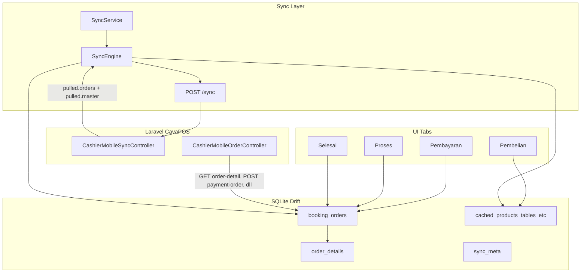
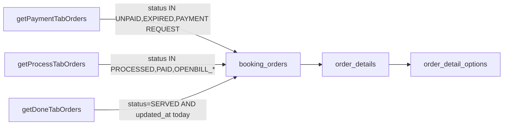

# Arsitektur Sinkronisasi Cavaa Cashier (Flutter ↔ Laravel)

## Gambaran Besar

Aplikasi ini memakai pola **offline-first mirror**: server Laravel ([`CavaPOS`](D:/farros/VCP/laravel/foodbee/CavaPOS)) adalah sumber kebenaran, tetapi UI kasir **selalu membaca dari database lokal** (`cashier.db` via Drift/SQLite). Sinkronisasi menjaga mirror lokal tetap up-to-date.



---

## 1. Bagaimana Data Didapat dari Server

Ada **dua jalur** pengambilan data:

### A. Jalur utama: Unified Sync (`POST /api/v1/mobile/cashier/sync`)

File kunci:
- Flutter: [`lib/features/cashier/data/sync/sync_engine.dart`](D:/farros/VCP/flutter/cavaa%20cashier/cavaa_cashier/lib/features/cashier/data/sync/sync_engine.dart), [`sync_api.dart`](D:/farros/VCP/flutter/cavaa%20cashier/cavaa_cashier/lib/features/cashier/data/sync/sync_api.dart)
- Laravel: [`CashierMobileSyncController.php`](D:/farros/VCP/laravel/foodbee/CavaPOS/app/Http/Controllers/Api/Mobile/Cashier/Sync/CashierMobileSyncController.php), [`CashierMobileSyncService.php`](D:/farros/VCP/laravel/foodbee/CavaPOS/app/Services/Mobile/Cashier/CashierMobileSyncService.php)

**Request mobile mengirim:**
```json
{
  "device_id": "<uuid perangkat>",
  "last_sync_token": "<cursor sync terakhir>",
  "push": {
    "booking_orders": [...],
    "order_details": [...],
    "deletes": [...]
  },
  "pull_scopes": ["orders", "master"]
}
```

**Server merespons:**
- `applied` — perubahan lokal berhasil diterapkan di server
- `conflicts` — konflik versi (`sync_version`)
- `errors` — gagal push
- `pulled.orders` — `booking_orders`, `order_details`, `order_payments`, `deleted_booking_orders`
- `pulled.master` — produk, kategori, meja, metode pembayaran, setting partner
- `sync_token` — disimpan di `sync_meta` untuk sync berikutnya

**Kapan sync dipicu** ([`cashier_home_page.dart`](D:/farros/VCP/flutter/cavaa%20cashier/cavaa_cashier/lib/features/cashier/presentation/pages/cashier_home_page.dart)):
- Setelah login (bootstrap)
- Koneksi kembali online
- App resume ke foreground
- FCM push (`new_order`, `order_updated`, `order_cancelled`)
- Pull-to-refresh di tab Proses
- `SyncWorker` setiap **2 menit** — hanya jika ada data pending (`sync_dirty`)
- Setelah aksi pembayaran (background)

### B. Jalur langsung: REST per aksi (online-first)

File: [`lib/features/cashier/data/orders_api.dart`](D:/farros/VCP/flutter/cavaa%20cashier/cavaa_cashier/lib/features/cashier/data/orders_api.dart)

| Endpoint | Kegunaan |
|----------|----------|
| `GET order-detail/{id}` | Detail lengkap order (prefetch, buka modal, recovery pembayaran) |
| `POST payment-order/{id}` | Bayar + upload bukti |
| `POST process-order/{id}` | Kirim ke dapur / serve item |
| `POST finish-order/{id}` | Selesaikan order |
| `POST update-order/{id}` | Edit order |
| `POST delete-order/{id}` | Hapus order |
| `GET products` | Katalog (fallback) |
| `POST checkout` | Checkout online |

Setelah REST sukses, hasilnya di-`upsert` ke mirror lokal.

### C. Katalog Pembelian

[`PurchaseRepository`](D:/farros/VCP/flutter/cavaa%20cashier/cavaa_cashier/lib/features/cashier/data/models/purchase_repository.dart) menarik `pull_scopes: ['master']` via `/sync`, atau fallback `GET /products`, lalu simpan ke tabel `cached_*`.

---

## 2. Bagaimana Data Disimpan ke Database Lokal

**Database:** `cashier.db` (Drift v15) — [`cashier_db.dart`](D:/farros/VCP/flutter/cavaa%20cashier/cavaa_cashier/lib/features/cashier/data/local/db/cashier_db.dart)

### Tabel order mirror (inti sinkronisasi)

| Tabel | Isi |
|-------|-----|
| `booking_orders` | Header order: status, customer, meja, total, payment, `sync_dirty`, `sync_intent`, `sync_version`, `server_id` |
| `order_details` | Item pesanan per order |
| `order_detail_options` | Opsi produk (size, topping, dll) |
| `order_payments` | Riwayat pembayaran dari server |
| `sync_conflicts` | Konflik sync yang belum diselesaikan |
| `sync_meta` | `device_id`, `last_sync_token`, `last_master_sync` |

### Tabel cache master (tab Pembelian)

`cached_products`, `cached_categories`, `cached_tables`, `cached_payment_methods`, `cached_option_groups`, `cached_option_items`, `cached_partner_settings`

### Alur penyimpanan

1. **Aksi offline / draft:** `BookingOrdersDao.createDraftOrder()` → set `sync_dirty=true` + `sync_intent` (CREATE, PAY, PROCESS, FINISH, DELETE, SERVE_ITEMS, OFFLINE_CATCH_UP)
2. **Pull dari server:** `SyncEngine._applyResponse()` → `upsertFromServer()`, `upsertDetailFromServerRow()`, `upsertPaymentFromServer()`
3. **Push berhasil:** `applyAppliedResult()` → clear `sync_dirty`, assign `server_id`, update `sync_version`
4. **Prefetch detail:** `repo.fetchOrderDetail(id)` → `bookingOrdersDao.upsertFromServer(detail)` — mengisi field tambahan seperti `payment_request`, `available_payment_methods`, `wifi_snapshot`

---

## 3. Bagaimana Data Ditempatkan ke Masing-masing Tab

Shell UI: [`cashier_home_page.dart`](D:/farros/VCP/flutter/cavaa%20cashier/cavaa_cashier/lib/features/cashier/presentation/pages/cashier_home_page.dart) — `IndexedStack` 4 tab.

Koordinator reload: [`order_tab_coordinator.dart`](D:/farros/VCP/flutter/cavaa%20cashier/cavaa_cashier/lib/features/cashier/data/sync/order_tab_coordinator.dart) memanggil `payment.load()` → `process.load()` + `done.load()`.

### Tab 0 — Pembelian

- **Sumber:** `cached_*` tables (bukan `booking_orders`)
- **Provider:** `PurchaseProvider`
- **Data:** produk, kategori, meja, metode bayar, setting PPN/rounding
- **Cart:** in-memory sampai checkout → tulis ke `booking_orders` mirror

### Tab 1 — Pembayaran

- **Query lokal:** `getPaymentTabOrders()` — status `UNPAID`, `EXPIRED`, `PAYMENT REQUEST`
- **Provider:** `PaymentProvider` → baca mirror → `OrderTabItemMapper.toPaymentItem()`
- **Filter tambahan:** sembunyikan order yang sudah ada di tab Proses/Selesai
- **Grup UI:** Konfirmasi Bayar, Open Bill, Bayar di Kasir, QRIS Kedaluwarsa
- **Field kartu:** `booking_order_code`, `customer_name`, meja, grand total, status badge, sync status

### Tab 2 — Proses

- **Query lokal:** `getProcessTabOrders()` — status `PROCESSED`, `PAID`, `OPENBILL_WAITING_ORDER`, `OPENBILL_CONFIRMATION`
- **Provider:** `ProcessProvider` → `OrderTabItemMapper.toProcessItem()`
- **Grup UI:** Open Bill Confirm, In Progress
- **Field kartu:** kode order, customer, meja, total, status item dapur

### Tab 3 — Selesai

- **Query lokal:** `getDoneTabOrders()` — status `SERVED` + **hanya hari ini** (`updated_at` today)
- **Provider:** `DoneProvider` → `OrderTabItemMapper.toDoneItem()`
- **Field kartu:** kode, customer, meja, total, waktu — aksi cetak struk

### Mapping status → tab

Aturan di [`order_stage_resolver.dart`](D:/farros/VCP/flutter/cavaa%20cashier/cavaa_cashier/lib/features/cashier/data/sync/order_stage_resolver.dart):

```
UNPAID / EXPIRED / PAYMENT REQUEST  →  Pembayaran
PROCESSED / PAID / OPENBILL_*         →  Proses
SERVED (hari ini)                     →  Selesai
```

---

## 4. Data Apa Saja yang Dibawa

### Per order header (`booking_orders`)

`id`, `booking_order_code`, `partner_id/name`, `table_id`, `customer_id/name`, `order_by`, `order_status`, `payment_method`, `openbill_flag`, `discount_*`, `total_order_value`, `ppn`, `payment_id/flag`, `wifi_snapshot`, `payment_request`, `latest_payment`, `created_at`, `updated_at`, `sync_version`, plus field sync lokal (`sync_dirty`, `sync_intent`, `client_uuid`)

### Per order detail (`order_details`)

`product_id`, nama produk, qty, harga, status item (mis. SERVED BY KITCHEN), catatan, opsi

### Master data (tab Pembelian)

Produk + stok + gambar + opsi, kategori, meja, metode pembayaran manual/QRIS, setting partner (PPN, rounding, fitur)

### Yang TIDAK lewat sync utama

Laporan penjualan, version-check APK, auth token — endpoint terpisah.

---

## 5. Penjelasan Log Terminal: `GET order-detail` Berulang

### Apakah itu sinkronisasi?

**Sebagian besar BUKAN sync utama.** Sync utama tercatat sebagai:
```
🔄 SYNC POST /sync
```

Log yang Anda lihat:
```
➡️ HTTP GET .../order-detail/857
✅ HTTP GET .../order-detail/857 → 200
```

Itu adalah **background prefetch detail order**, bukan endpoint `/sync`.

### Siapa yang memicu prefetch?

| Provider | File | Kapan |
|----------|------|-------|
| `ProcessProvider` | [`process_provider.dart` L156-196](D:/farros/VCP/flutter/cavaa%20cashier/cavaa_cashier/lib/features/cashier/presentation/providers/process_provider.dart) | Setelah `load()`, jika online + ada item + tidak ada pending sync → fetch **setiap order** di tab Proses |
| `DoneProvider` | [`done_provider.dart` L86-110](D:/farros/VCP/flutter/cavaa%20cashier/cavaa_cashier/lib/features/cashier/presentation/providers/done_provider.dart) | Setelah `load()`, prefetch **setiap order SERVED hari ini** |
| Buka detail manual | `getOrderDetailFromListItem()` | Saat user buka sheet detail |
| Payment recovery | [`payment_submit_recovery.dart`](D:/farros/VCP/flutter/cavaa%20cashier/cavaa_cashier/lib/features/cashier/data/sync/payment_submit_recovery.dart) | Setelah timeout pembayaran |

Order di log Anda (`857`, `858`, `846`, `844`...) kebanyakan `order_status: SERVED` — cocok dengan **prefetch tab Selesai** dan/atau Proses.

Prefetch dipicu ulang setiap kali `reloadAllTabs()` dipanggil (setelah sync, FCM, reconnect, resume app).

### Tentang `order-detaill` vs `order-detail` di log

Di source code hanya ada `order-detail` (benar). String `order-detaill` di log **kemungkinan artefak interleaving** — banyak request HTTP concurrent, logger menulis request/response tidak berurutan sehingga baris log tampak menyatu (`order-detail/857` + `l/858` → `order-detaill/858`). Endpoint aktual yang dipanggil adalah `order-detail`.

### Apakah membuat server load tinggi?

**Ya, bisa signifikan** dalam kondisi tertentu:

| Faktor | Dampak |
|--------|--------|
| **N+1 prefetch** | Jika ada 20 order di tab Selesai + 10 di Proses, setiap reload = ~30 request `order-detail` terpisah |
| **Response besar** | Setiap `order-detail` membawa `available_payment_methods` dengan `additional_info` panjang (terlihat di log Anda, truncated ~9-15KB per response) |
| **Reload berulang** | FCM + resume + sync + debounce reload bisa memicu prefetch berkali-kali untuk order yang sama |
| **Tidak ada cache TTL prefetch** | Tidak ada pengecekan "sudah prefetch belum" sebelum fetch ulang |

**Sync utama (`POST /sync`)** juga perlu diperhatikan: di Laravel [`pullOrders()`](D:/farros/VCP/laravel/foodbee/CavaPOS/app/Services/Mobile/Cashier/CashierMobileSyncService.php) saat ini mengambil **semua booking_orders partner** (tanpa filter incremental pada header order), yang juga bisa berat jika order banyak.

**Yang relatif ringan:**
- `SyncWorker` 2 menit hanya jalan jika ada `sync_dirty` (perubahan lokal pending)
- Debounce 400ms mencegah reload beruntun dalam milidetik

### Ringkasan jawaban singkat

| Pertanyaan | Jawaban |
|------------|---------|
| Apakah log itu fetch untuk sinkronisasi? | **Sebagian ya** (setelah sync, tab di-reload → prefetch jalan). Tapi request `order-detail` itu sendiri adalah **prefetch tambahan**, bukan mekanisme sync utama |
| Apakah load server tinggi? | **Bisa**, terutama jika banyak order SERVED hari ini dan app sering reload tab. Bukan polling `/sync` tiap detik, tapi **burst GET per order** setiap reload |

---

## Rekomendasi Optimasi (opsional, jika ingin diterapkan nanti)

1. **Skip prefetch** jika `upsertFromServer` sudah punya data lengkap (cek `sync_version` / timestamp)
2. **Prefetch throttled** — max N order per reload, atau hanya order yang belum punya `payment_request`/`order_details` lengkap
3. **Hapus prefetch tab Selesai** — order SERVED jarang butuh refresh detail penuh
4. **Incremental pull** di Laravel `pullOrders()` — filter `updated_at > since` pada header order
5. **Kurangi payload** `order-detail` — jangan kirim `available_payment_methods` lengkap untuk order yang sudah SERVED

---

## FAQ: Query Tab, Payment Methods, dan Dampak Optimasi

### Apa yang dilakukan `getPaymentTabOrders()`, `getProcessTabOrders()`, `getDoneTabOrders()`?

Ketiga fungsi ini **query tabel yang sama** — `booking_orders` — lalu join ke tabel terkait yang sama:

| Fungsi | Tabel utama | Filter `order_status` | Filter tambahan |
|--------|-------------|----------------------|-----------------|
| `getPaymentTabOrders()` | `booking_orders` | `UNPAID`, `EXPIRED`, `PAYMENT REQUEST` | `deleted_at IS NULL` |
| `getProcessTabOrders()` | `booking_orders` | `PROCESSED`, `PAID`, `OPENBILL_WAITING_ORDER`, `OPENBILL_CONFIRMATION` | `deleted_at IS NULL` (+ opsional `employeeId`) |
| `getDoneTabOrders()` | `booking_orders` | `SERVED` | `deleted_at IS NULL` + **`updated_at` hari ini saja** |

Implementasi di [`booking_orders_dao.dart`](lib/features/cashier/data/local/db/daos/booking_orders_dao.dart):

- Payment & Proses memakai helper `_queryTabOrders(statuses: [...])`
- Selesai punya query sendiri (karena filter tanggal), tapi tetap ke `booking_orders`

Setelah baris order didapat, **semua tab** melewati `_mapRowsWithDetails()` yang untuk setiap order juga query:

- `order_details` (filter `booking_order_client_uuid`)
- `order_detail_options` (filter per detail)

Jadi perbedaannya **bukan tabel berbeda**, melainkan **filter status (dan tanggal untuk Selesai)**. Satu order hanya muncul di satu tab pada satu waktu karena `order_status`-nya unik per tahap lifecycle.



---

### Apakah setiap order punya `available_payment_methods`?

**Di response API `GET order-detail/{id}`: ya** — Laravel selalu inject field ini di [`CashierMobileOrderController::orderDetail()`](D:/farros/VCP/laravel/foodbee/CavaPOS/app/Http/Controllers/Api/Mobile/Cashier/Order/CashierMobileOrderController.php):

```php
$order->setAttribute('available_payment_methods', $this->buildAvailablePaymentMethods($order->partner));
```

**Di database lokal mirror (`booking_orders`): tidak.** Tidak ada kolom JSON untuk `available_payment_methods`. Field ini **tidak disimpan permanen** per order di SQLite; hanya ada sementara di memori saat response API diproses.

**Isi `available_payment_methods` sebenarnya data partner-level**, bukan spesifik order:

- Cash aktif/tidak (`is_cashier_active`)
- QRIS aktif/tidak (`is_qr_active`)
- Daftar manual payment partner (`PartnerManualPayment` + `ownerManualPayment`)
- Termasuk `additional_info` prosedur pembayaran (contoh OVO — inilah yang membuat response sangat besar)

**Untuk apa?** Dipakai UI pembayaran saat kasir **memilih metode bayar** di [`payment_process_sheet.dart`](lib/features/cashier/presentation/pages/tabs/modals/payment_process_sheet.dart) — getter `_availablePaymentMethods` membaca field ini dari objek order.

---

### Kenapa tidak jadi data master saja?

**Sebenarnya sudah ada sebagai master**, terpisah dari order:

| Lapisan | Lokasi |
|---------|--------|
| Server master | `GET /products` dan `pull_scopes: master` via `/sync` |
| Lokal master | Tabel `cached_payment_methods` (Drift) |
| Builder lokal | `CachedPaymentMethodsDao.buildAvailablePaymentMethodsList()` |

Saat kasir membuka flow bayar, mobile **sudah mengganti** daftar dari API dengan cache master:

```dart
// payment_provider.dart — _enrichOrderDetailPaymentData()
final cachedMethods = await cachedPaymentMethodsDao.buildAvailablePaymentMethodsList();
if (cachedMethods.isNotEmpty) {
  cloned['available_payment_methods'] = cachedMethods;
}
```

Jadi duplikasi di `order-detail` **kelebihan beban** untuk kebanyakan skenario. Laravel menempelkannya agar client web/lama bisa dapat satu payload lengkap tanpa fetch master terpisah.

**Hipotesis Anda benar:** attach ulang per request juga mengantisipasi owner mengubah metode pembayaran (aktif/nonaktif, rekening baru, QRIS baru). Master sync (`pull master`) sudah menangani ini; prefetch `order-detail` adalah jalur redundan.

---

### Apakah optimasi rekomendasi akan menimbulkan konflik mobile: mobile vs server?

**Tidak**, selama optimasi dibatasi pada **prefetch baca-baca** dan **payload API** — bukan pada logika push/sync order.

| Optimasi | Risiko konflik | Penjelasan |
|----------|----------------|------------|
| Hapus prefetch tab Selesai | **Tidak ada** | Order `SERVED` read-only; tidak ada `sync_dirty` / mutasi |
| Skip prefetch jika `sync_version` sama | **Tidak ada** | Prefetch hanya enrich mirror; konflik hanya terjadi saat **push** perubahan lokal (`sync_dirty` + intent CREATE/PAY/PROCESS/FINISH) bertabrakan `sync_version` server |
| Pakai `cached_payment_methods` untuk picker bayar | **Tidak ada** | Sudah pola existing; `available_payment_methods` bukan field yang di-sync atau di-push |
| Kurangi payload `order-detail` di Laravel | **Tidak ada** | Field referensi read-only; tidak masuk mekanisme `applied` / `conflicts` |
| Incremental `pullOrders()` di Laravel | **Rendah*** | Bukan konflik versi, tapi risiko **miss update** jika filter `since` salah — perlu tes, bukan conflict resolution |

**Yang memicu konflik sync sebenarnya:**

- Dua device mengedit order yang sama
- `sync_version` server > versi lokal saat push
- Intent stage tidak valid (mis. PAY saat status sudah SERVED)

Optimasi prefetch **tidak mengubah** `sync_dirty`, `sync_intent`, atau payload push — jadi **aman dari sisi conflict resolution**.

**Satu hal yang perlu dijaga:** untuk order `UNPAID` / `PAYMENT REQUEST`, saat kasir **membuka sheet bayar**, pastikan master cache cukup fresh (via `pull master` saat login/reconnect/sync, atau fetch `order-detail` on-demand saat sheet dibuka — bukan prefetch massal di background). Itu mengganti prefetch proaktif dengan fetch reaktif, tanpa risiko konflik.
